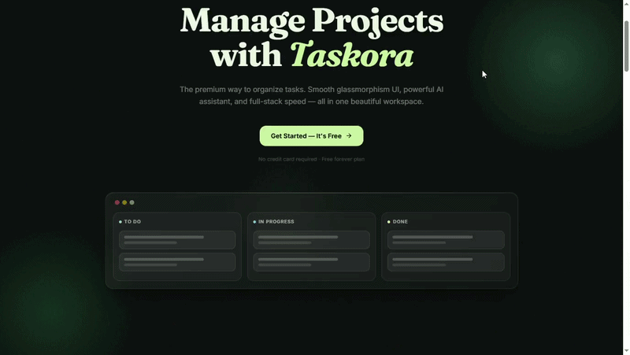
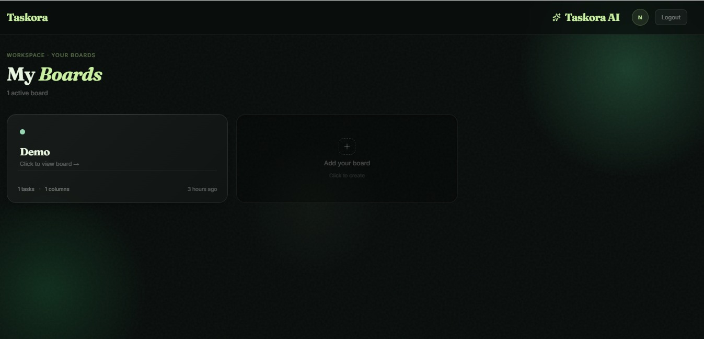
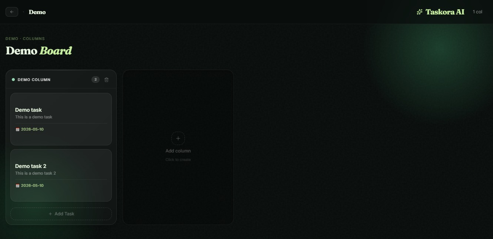

# ✦ Taskora

### AI-Powered Kanban Task Manager

**A premium task management app with drag-and-drop boards, an AI assistant that auto-generates sub-tasks, and a glassmorphism UI built for developers who care about how their tools look.**

[](https://taskora-beta.vercel.app)
[](https://nextjs.org/)
[](https://supabase.com/)
[](https://tailwindcss.com/)
[](https://ui.shadcn.com/)
[](https://vercel.com/)

---

## 🎬 Demo




## 📸 Screenshots

| Boards                                           | Columns And Task                                          |
| --------------------------------------------------------------- | ----------------------------------------------------------- |
|  |  |

---

## 🎯 What is Taskora?

Taskora is an **AI-powered task manager** built for solo developers and small teams. You get drag-and-drop boards, an AI assistant that generates sub-tasks and cleans up completed work, and smart deadline notifications — all running on a modern full-stack setup with real authentication and persistent storage.

> **The Problem:** Most task managers are either too bloated (Jira, Asana) or too simple (plain to-do lists). Taskora sits in the middle — powerful enough for real workflows, fast and beautiful enough that you actually want to use it.

---

## ✨ Key Features

### 🤖 Taskora AI Assistant
- Auto-generates sub-tasks based on your goals
- Suggests deadlines based on task complexity
- Archives or auto-deletes completed tasks to keep boards clean

### 🔐 Enterprise-Grade Security
- Supabase Auth with SSR middleware for protected routes
- Row-Level Security at the database layer — no application-level filtering hacks
- Encrypted data storage, SOC2-compliant infrastructure

### 🎨 Premium UI
- Glassmorphism aesthetic built with Tailwind CSS v4 + shadcn/ui
- Framer Motion animations throughout
- Fully responsive — desktop, tablet, and mobile

---

## 🛠️ Tech Stack

| Layer | Technology | Purpose |
|---|---|---|
| **Framework** | Next.js 16 (App Router) | Full-stack React, SSR, routing |
| **Language** | TypeScript | Type safety across the entire codebase |
| **Database** | Supabase (PostgreSQL) | Persistent storage with RLS policies |
| **Auth** | Supabase Auth + SSR | Email/password auth, session management |
| **Styling** | Tailwind CSS v4 | Utility-first, zero-config CSS |
| **Components** | shadcn/ui + Radix UI | Accessible, composable UI primitives |
| **Animations** | Framer Motion | Smooth entrance animations, transitions |
| **Icons** | Lucide React | Consistent icon system |
| **Deployment** | Vercel |

---

## 🏗️ Architecture

```
Taskora
├── Next.js App Router (Frontend + API)
│   ├── /app/(auth)         → Login, Signup pages
│   ├── /app/dashboard      → Protected board dashboard
│   ├── /app/board/[id]     → Individual Kanban board
│   └── middleware.ts       → Supabase session & route protection
│
├── Supabase (Backend)
│   ├── PostgreSQL          → Boards, tasks, users
│   ├── Row Level Security  → Per-user data isolation
│   └── Auth                → Session & JWT management
│
└── Vercel
    └── Production deployment with automatic preview branches
```

### 🔒 Auth & Data Isolation

Route protection is handled via `middleware.ts` using Supabase SSR — sessions are verified server-side before any page loads. Database queries are scoped per user using RLS policies, so even if application code had a bug, the database would still reject unauthorized reads.

---

## 💳 Plans

| Plan | Price | What You Get |
|---|---|---|
| **Free** | ₹0/month | 3 boards, core task management, mobile access |
| **Pro** | ₹199/month | Unlimited boards, AI assistant, custom themes, auto-delete |
| **Max** | ₹219/month | Everything in Pro + team collaboration, SMS alerts, admin dashboard, SSO/SAML |

> Annual billing available — saves ~20% on paid plans.  
> Students get Pro free with a valid `.edu` email.

---

## 🚀 Getting Started

### Prerequisites

- Node.js 18+
- A [Supabase](https://supabase.com) project (free tier works fine)

### 1. Clone the repo

```bash
git clone https://github.com/priyanshu101120/TASKORA.git
cd TASKORA
```

### 2. Install dependencies

```bash
npm install
```

### 3. Set up environment variables

Create a `.env.local` file in the root:

```env
NEXT_PUBLIC_SUPABASE_URL=your_supabase_project_url
NEXT_PUBLIC_SUPABASE_ANON_KEY=your_supabase_anon_key
```

Both values are in your Supabase project under **Settings → API**.

### 4. Run the dev server

```bash
npm run dev
```

Open [http://localhost:3000](http://localhost:3000).

---

## 📁 Project Structure

```
TASKORA/
├── src/
│   ├── app/          # Next.js App Router — pages & layouts
│   ├── components/   # Reusable UI components
│   └── hooks/        # Custom React hooks (Plan types, board logic)
├── public/           # Static assets
├── middleware.ts     # Supabase auth middleware — route protection
├── components.json   # shadcn/ui config
└── next.config.ts    # Next.js config
```

---

## 🧠 What I Learned

Building Taskora end-to-end as a solo developer taught me:

- **Supabase SSR auth** — handling sessions correctly in the App Router with middleware, not just client-side checks
- **Tailwind CSS v4** — the new config-free setup is a significant shift from v3; learned the new approach hands-on
- **shadcn/ui composition** — building complex UI from primitives without fighting the component library
- **Glassmorphism at scale** — layering `backdrop-blur`, `border-white/8`, and subtle gradients without killing performance
- **Pricing UX** — monthly/yearly toggle with real-time price recalculation, and how small UI decisions affect conversion intent

---

## 🔮 Roadmap

- [ ] Real drag-and-drop between columns (dnd-kit integration)
- [ ] Taskora AI — live sub-task generation via LLM API
- [ ] Team collaboration (shared boards, member invites)
- [ ] SMS notifications for deadlines (Max plan)
- [ ] Analytics dashboard — task completion rates, velocity tracking
- [ ] Mobile app (React Native / Expo)

---

## 👤 Author

**Priyanshu Singh** — Built this end-to-end as a solo developer.

[](https://github.com/priyanshu101120)
[](https://www.linkedin.com/in/priyanshu-singh-452459360/)

---

## 📄 License

This project is open source and available under the [MIT License](LICENSE).

---

**⭐ If you found this project useful, consider giving it a star!**

*Built with 💚 using Next.js, Supabase, and shadcn/ui*